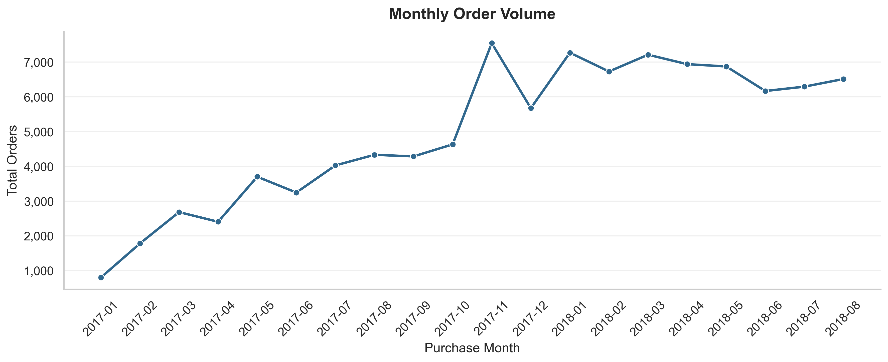
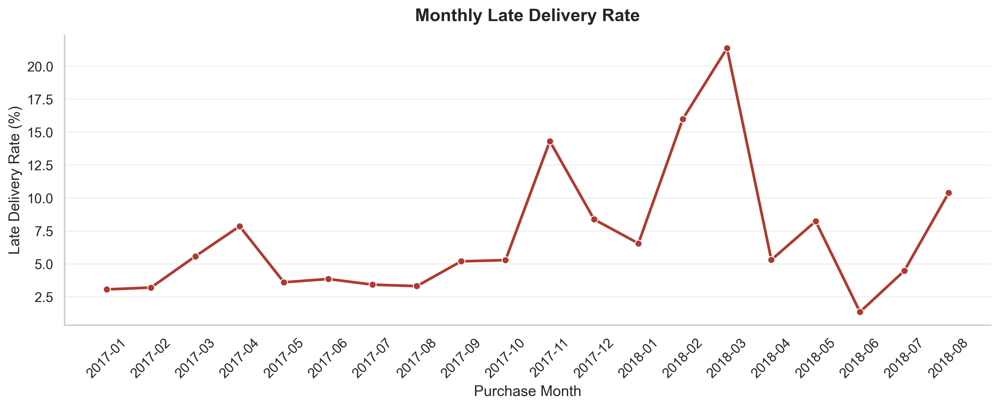
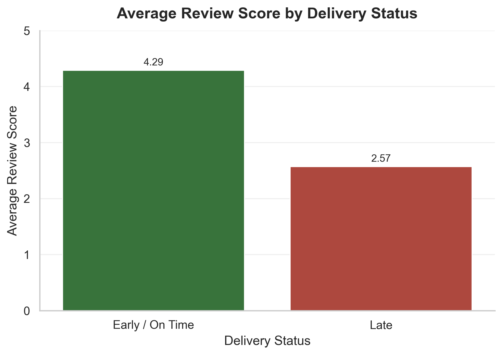
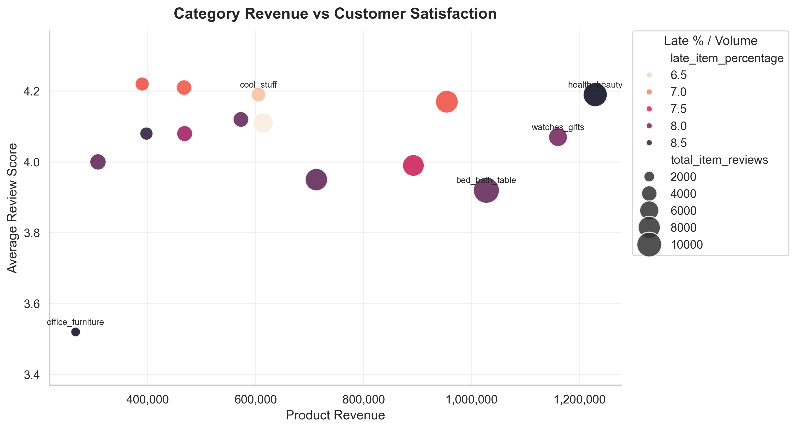

# Brazilian E-Commerce Business Performance Analysis

This project analyzes business performance in the Brazilian e-commerce market using the **Olist Brazilian E-Commerce Public Dataset** from **Kaggle**.

This was my second main data analysis project, and it was a clear step up from my first single-table EDA project. Instead of working with one simple table, this project forced me to work with multiple related tables, different row grains, joins, delivery dates, customer reviews, sellers, products, and enough complexity to think more like an analyst instead of just writing code.

The analysis combines **SQL, SQLite, Python, Pandas, Matplotlib, and Seaborn** to explore order volume, delivery reliability, customer satisfaction, seller and category performance, and product revenue patterns.

A major focus of this project was making sure joins and metrics were handled carefully so that the analysis stayed accurate and business-relevant.

## Business Questions

This project focuses on the following questions:

- How did order volume change over time?
- How reliable was delivery performance?
- How strongly is late delivery associated with customer review scores?
- Which product categories generate the most revenue?
- Which categories perform well commercially but show weaker customer-experience signals?
- Are late delivery issues concentrated in specific months or customer states?

## Dataset

This project uses the **Olist Brazilian E-Commerce Public Dataset** from Kaggle.

The dataset includes multiple CSV files covering:

- Orders
- Customers
- Sellers
- Products
- Order items
- Payments
- Reviews
- Geolocation data
- Product category translations

The full dataset covers orders from **September 2016 to October 2018**. However, the earliest and latest months contain very few orders, so time-series visualizations focus mainly on the more reliable period from **January 2017 to August 2018**.

Because the dataset contains multiple tables with different row grains, the first step of the project focused on understanding table structure, keys, duplicates, missing values, and relationships before performing business analysis.

## Tools Used

- Python 3.10+
- Pandas
- SQLite
- SQL
- Matplotlib
- Seaborn
- Jupyter Notebook

## Project Structure

```text
.
├── README.md
├── requirements.txt
├── .gitignore
├── data/
│   ├── raw/
│   │   └── raw Olist CSV files
│   └── processed/
│       └── olist.db
├── notebooks/
│   ├── 01_schema_exploration.ipynb
│   ├── 02_sql_business_analysis.ipynb
│   └── 03_visualizations_and_insights.ipynb
├── reports/
│   └── figures/
│       └── exported visualizations
└── sql/
    └── business_analysis_queries.sql
```

## Setup and Environment

Install the required Python packages with:

```bash
pip install -r requirements.txt
```

The project was built with **Python 3.10+**. It may work on nearby Python versions, but Python 3.10 or newer is recommended.

The raw dataset files are not included in this repository. Download the Olist dataset from Kaggle and place the CSV files inside:

```text
data/raw/
```

Then run the schema exploration notebook to create the SQLite database:

```text
data/processed/olist.db
```

## Data and GitHub Size Notes

The raw CSV files and generated SQLite database are intentionally excluded from Git tracking.

After running the first notebook, the generated SQLite database may exceed **100 MB**, which is above GitHub's normal file-size limit. For that reason, `data/raw/` and `data/processed/` are ignored through `.gitignore`, while empty `.gitkeep` files preserve the folder structure.

Anyone running the project should download the raw dataset from Kaggle and recreate the database locally by running `01_schema_exploration.ipynb`.

## Notebook Runtime Notes

Runtime depends on the machine, but the notebooks are not expected to take very long.

Approximate expectation:

- `01_schema_exploration.ipynb`: builds the SQLite database and may take a few minutes.
- `02_sql_business_analysis.ipynb`: runs the main SQL analysis and may take around 1-3 minutes.
- `03_visualizations_and_insights.ipynb`: generates visualizations and usually runs faster once the database exists.

## Analytical Definitions

### Late Delivery

A delivered order was classified as **late** when:

```text
order_delivered_customer_date > order_estimated_delivery_date
```

Orders delivered on or before the estimated delivery date were classified as **Early / On Time**.

### Delivered Orders

Most delivery and satisfaction analyses focus on orders where:

```text
order_status = 'delivered'
```

and where the delivery date fields needed for the analysis were not null.

Cancelled, unavailable, and other non-delivered order statuses were included in the order-status overview, but they were excluded from delivery-time and late-delivery analyses because they do not represent completed deliveries.

### Row Grain

A major part of this project was tracking row grain carefully:

- `orders` is order-level.
- `order_items` is item-level.
- `reviews` is review-level.
- Joining `orders` to `order_items` changes the result to item-level.
- Joining `orders`, `order_items`, and `reviews` creates item-review-level outputs.

Metric names such as `total_orders`, `total_items`, and `total_item_reviews` were chosen carefully to avoid overstating what each query measures.

## SQL Query File

The `sql/business_analysis_queries.sql` file is a standalone reference copy of the main SQL queries used in `02_sql_business_analysis.ipynb`.

It is useful for reviewing the SQL without opening the notebook. It can also be run against the generated SQLite database using a SQLite client such as DB Browser for SQLite or the `sqlite3` command-line tool.

Example:

```bash
sqlite3 data/processed/olist.db < sql/business_analysis_queries.sql
```

The notebook version remains the main analysis file because it includes the SQL outputs and written observations.

## Notebook Breakdown

### 01_schema_exploration.ipynb

This notebook focuses on understanding the dataset before performing business analysis.

It includes:

- Loading the raw CSV files
- Checking table shapes
- Checking missing values
- Checking duplicate rows and duplicate keys
- Identifying primary keys and composite keys
- Understanding the grain of each table
- Inspecting date columns
- Converting the raw CSV files into a SQLite database

This step was important because the dataset contains multiple related tables, and joining them without understanding their structure could easily lead to misleading results.

### 02_sql_business_analysis.ipynb

This notebook contains the main SQL-based business analysis.

It includes:

- Order status overview
- Delivered vs. not delivered orders
- Monthly order trends
- Delivery time analysis
- Delivery time buckets
- Late delivery rate analysis
- Review score analysis
- Customer-state delivery performance
- Seller-state delivery performance
- Product-category revenue analysis
- Category performance summary

A major focus in this notebook was being careful with row grain. For example, joining orders with order items changes the analysis from order-level to item-level, while joining reviews can create item-review-level outputs. Because of this, metrics were named carefully to avoid overclaiming what the SQL results actually measure.

### 03_visualizations_and_insights.ipynb

This notebook turns the strongest SQL results into clear visual insights.

It includes:

- Monthly order volume line chart
- Monthly late delivery rate line chart
- Delivery-time distribution by review score using a violin plot
- Late delivery heatmap by customer state and month
- Average review score by delivery status
- Top product categories by revenue
- Category performance scatterplot using revenue, review score, late delivery percentage, and volume

The visualizations were built using reusable plotting functions with `fig, ax`, consistent styling, and exported figures using:

```python
fig.savefig(..., dpi=300, bbox_inches="tight")
```

## Key Insights

### 1. Order volume grew strongly through 2017

Order volume increased throughout 2017 and stayed high through most of 2018. November 2017 was the strongest month in the reliable analysis period.

The earliest and latest months had very low order counts, so they were treated as partial months rather than interpreted as true business declines.

### 2. Most delivered orders arrived within a reasonable time

Most delivered orders arrived within 14 days, and around 95% arrived within 30 days.

Very long delivery times did exist, but they represented a small tail rather than the typical customer experience.

### 3. Late delivery is strongly associated with lower review scores

Orders delivered early or on time had much higher average review scores than late orders.

This does not prove that late delivery is the only reason for low customer reviews. Product quality, seller behavior, customer expectations, and other factors may also affect satisfaction. However, the analysis clearly suggests that delivery reliability is an important part of the customer experience.

### 4. Late delivery problems were not evenly distributed

Late delivery rates changed significantly across months. Some months showed much stronger delivery problems than others, especially around high-volume periods.

The heatmap also showed that late delivery issues were not evenly distributed across customer states. This suggests that geography, logistics coverage, seller-to-customer distance, or temporary operational pressure may have played a role.

### 5. Revenue leaders are not always customer-experience leaders

Health/beauty was one of the strongest categories overall, generating the highest product revenue while still maintaining a solid average review score.

Watches/gifts also generated high revenue, but this appeared to be more price-driven because the category had a much higher average item price.

Bed/bath/table was one of the most important categories to monitor. It had high item volume and strong revenue, but weaker review scores and relatively high late delivery rates.

This was one of the main lessons of the project: business performance should not be judged by revenue alone.

## Example Visuals









## How to Run This Project

1. Download the Olist Brazilian E-Commerce dataset from Kaggle.
2. Place the raw CSV files inside the `data/raw/` folder.
3. Install the required packages using `pip install -r requirements.txt`.
4. Open and run `notebooks/01_schema_exploration.ipynb` to inspect the dataset and create the SQLite database.
5. Run `notebooks/02_sql_business_analysis.ipynb` to perform the SQL analysis.
6. Run `notebooks/03_visualizations_and_insights.ipynb` to generate and export the visualizations.

## What I Learned

This project helped me move beyond basic single-table exploratory data analysis and practice a more realistic business analysis workflow.

The biggest lessons were:

- Understanding table grain before joining data
- Avoiding misleading metrics caused by many-to-one or many-to-many joins
- Separating order-level, item-level, and item-review-level analysis
- Using SQL to answer business questions
- Turning query results into clear visual insights
- Choosing visualizations based on the business question
- Communicating findings without overclaiming causation

This project also made me more comfortable combining SQL, Pandas, and visualization in one workflow.

## Limitations

This is a learning project, so the goal was not to build a complete business intelligence system.

Some limitations include:

- The analysis is based on historical public data and may not reflect current e-commerce conditions.
- Review scores can be influenced by many factors beyond delivery speed.
- Late delivery is associated with lower review scores, but this analysis does not prove causation.
- Some months had partial data and were treated carefully to avoid misleading trend interpretations.
- Revenue analysis is based on product/order item values and does not include full profitability metrics such as margins, discounts, marketing costs, or operational costs.
- This project did not perform heavy data cleaning or imputation. Instead, missing values, duplicates, partial months, and outliers were handled through careful exploration, filtering, and interpretation during analysis.

## License

This project is licensed under the MIT License.

The original dataset is not included in this repository and remains subject to its original Kaggle/source terms.

## Final Summary

This project was a major step from basic EDA toward more realistic business analysis. It required working with multiple tables, thinking carefully about row grain, writing SQL queries for business questions, and communicating insights through clear visualizations.

The main takeaway is that strong business performance cannot be measured by revenue alone. Delivery reliability, customer satisfaction, category behavior, and regional performance all provide important context for understanding e-commerce performance.

Still learning, still improving, but this project was a big step forward 

Thank you for checking my project out. :)
